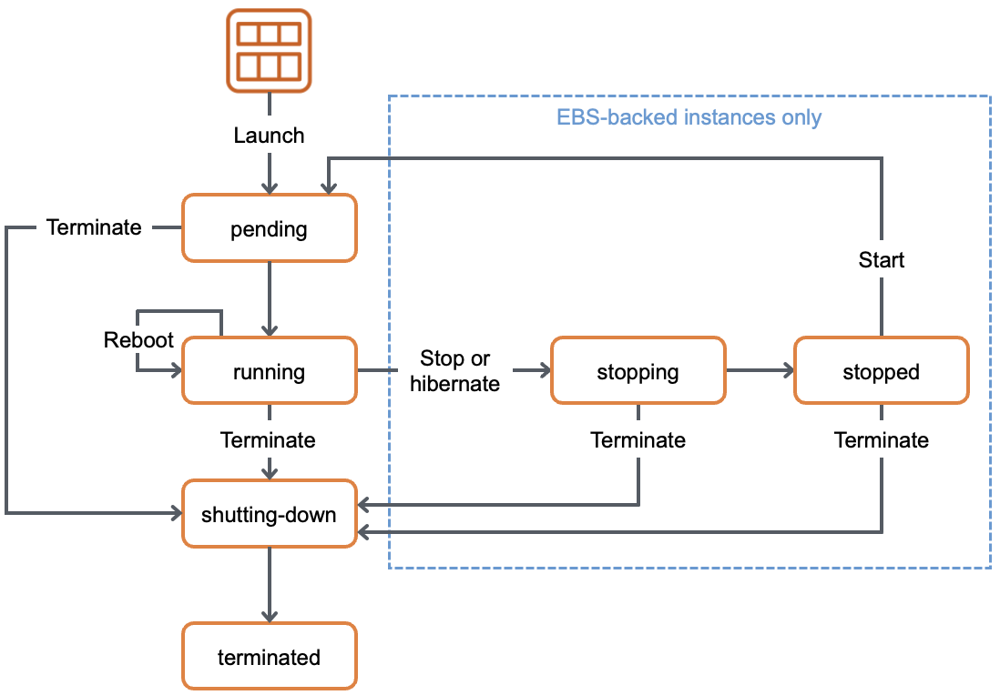

# Amazon EC2

- AWS의 퍼블릭 클라우드 환경에서 확장 가능한 컴퓨팅 자원을 제공하여 가상의 서버를 운영할 수 있는 서비스
- 인스턴스라는 가상 컴퓨팅 환경을 기반으로 하며, **AMI(Amazon Machine Image)**를 이용하여 인스턴스에 필요한 소프트웨어 정보를 정의
- 사용자가 요구하는 CPU, 메모리, 디스크, 운영 체제, 소프트웨어 등을 제공하여 워크로드에 맞는 최적화된 가상의 서버를 생성하고 관리할 수 있음

## 주요 제공 기능

- 운영체제
    - Linux, Windows, macOS
- CPU 옵션
    - ARM, X86
- 다양한 인스턴스 유형 제공
    - 범용 및 워크로드에 맞게 최적화 가능
- 구매 옵션
    - 온디멘드, 예약 인스턴스, 스팟 인스턴스 등

## 인스턴스

- 가상의 컴퓨팅 환경으로 CPU, 메모리, 스토리지, 네트워킹 용량을 결정하는 다양한 인스턴스 유형을 제공
- 클라우드 환경에서 컴퓨팅 자원을 필요한 만큼 사용하고 쓰임이 다하면 자원을 반납하는 형태

### 인스턴스 구조

- 예시: `t2.micro`
    - **t**: 인스턴스 패밀리, 용도별 분류
    - **2**: 인스턴스 세대, 높을수록 최신, 성능 우수
    - **micro**: 인스턴스 크기, 커질수록 용량 및 가격 증가
- https://aws.amazon.com/ko/ec2/instance-types/

### 인스턴스 상태

- 일곱 가지로 분류할 수 있으며 어떤 행위에 최종적으로 도달하는 상태와 진행 과정에 따른 상태로 나눌 수 있음
    - 실행중(running)
    - 중지됨
    - 종료됨
    - 대기 중
    - 중지 중
    - 재부팅
    - 종료 중
        
        
        
    - **최초 인스턴스를 시작하는 행위**: 대기중 → 실행중(특별한 이상이 없을 경우)
    - **실행 중인 인스턴스를 중지하는 행위**: 실행중 → 중지중 → 중지됨(인스턴스 종료가 아닌 일시적 중지 상태)
    - **중지된 인스턴스를 시작하는 행위**: 중지됨 → 대기 중 → 실행 중
    - **중지된 인스턴스를 종료하는 행위**: 중지됨 → 종료 중 → 종료됨(인스턴스 영구 삭제)
    - **실행 중인 인스턴스를 종료하는 행위**: 실행 중 → 종료 중 → 종료됨(인스턴스 영구 삭제)
- `중지됨` 상태
    - `인스턴스를 유지한 채 일시적으로 중지한` 상태
- `종료됨` 상태
    - `인스턴스를 영구 삭제` 상태
    - 종료됨 상태가 되어도 관리 콘솔상에서 바로 삭제되지 않으며 일정 시간 정보를 출력함

## AMI(Amazon Machine Image)

- 인스턴스를 시작할 때 필요한 정보를 제공하는 것
- 운영체제와 소프트웨어를 적절히 구성한 상태로 제공되는 템플릿(template)
- 인스턴스 생성 시 AMI를 지정해야 하며, 하나의 AMI로 동일한 구성의 여러 인스턴스를 생성할 수 있음
- 사용자 정의 또는 AWS Marketplace에서 제공하는 서드 파티용 AMI 또는 AWS 자체적으로 정의된 기본 AMI

## Amazon EC2 Storage

- 유연하고 효율적이며 사용하기 쉬운 데이터 스토리지 기능을 제공

### 인스턴스 스토어

- 인스턴스에 바로 붙어 있는 저장소로 EC2 인스턴스를 생성하면 기본적으로 존재하는 스토리지
- 일부 유형은 지원하지 않음
- 매우 빠른 I/O를 보장, 인스턴스 중단 혹은 종료 시 스토어에 저장된 데이터가 모두 손실

### Amazon EBS

- 외장 하드디스크와 비슷한 개념으로 인스턴스에 연결 및 제거를 하는 형태로 구성되는 블록 스토리지
- 인스턴스가 네트워킹을 통해 Amazon EBS에 접근하여 연결되는 구조로 영구 보존이 가능한 스토리지
- 인스턴스가 중지되거나 종료되어도 Amazon EBS에 보존하는 데이터는 그대로 유지할 수 있음
- 콘솔을 통해 스냅샷을 생성하여 백업하거나 연결을 해제한 후 다른 인스턴스에 연결할 수 있음

## Amazon EC2 Networking Services

- 서비스를 제공하려면 자연스럽게 통신이 가능한 환경으로 구성되어야 함

### Amazon VPC(Virtual Private Cloud)

- AWS 퍼블릭 클라우드 안에서 논리적으로 격리된 가상의 클라우드 네트워크
- EC2 인스턴스는 별도로 구성된 하나의 Amazon VPC 안에 생성되어 네트워킹

### Network Interface

- ENI(Elastic Network Interface)라는 논리적 네트워크 인터페이스가 VPC 내 생성, ENI를 EC2 인스턴스에 연결해 네트워킹을 수행

### IP Address

- 네트워크 인터페이스에는 IP(Internet Protocol) 주소가 있으며 IP 주소로 대상을 구분하고 네트워킹을 수행
- **프라이빗 IP**
    - 내부 구간의 통신을 위한 사설 IP
- **퍼블릭 IP**
    - 외부 구간의 통신을 위한 공인 IP

## Amazon EC2 Security

- 안정적으로 서비스를 제공하고 관리하기 위해 보안 기능을 제공

### Security Group

- EC2 인스턴스의 송수신 트래픽을 제어하는 가상의 방화벽 역할
- 인스턴스 기준으로 수신 트래픽에 대한 인바운드(inbound) 규칙과 송신 트래픽에 대한 아웃바운드(outbound) 규칙으로 되어 있으며, 대상 트래픽에 대한 허용과 거부를 결정
- 프로토콜, 포트 번호, IP 대역 등으로 트래픽을 정의

### Key Pair

- EC2 인스턴스에 연결할 때 자격을 증명하는 보안 키
- **퍼블릭 키**
    - EC2 인스턴스에 저장됨
- **프라이빗 키**
    - 사용자 컴퓨터에 별도로 저장
- EC2 인스턴스를 생성한 후 가상 서버에 접근하여 설정이 필요하면 사용자가 보관하고 있는 프라이빗 키를 활용하여 자격을 증명하고 접근할 수 있음

## Amazon EC2 Monitoring

- 서비스의 안정성과 가용성, 성능 유지에 필요한 중요한 영역
- EC2 인스턴스의 자원은 유한하며 자원 이상의 부하가 있을 경우 장애 발생할 수 있음
- 모니터링 및 경보 수행 시 계획을 정의해서 생성해야 함
    - 모니터링 목표
    - 모니터링 대상 자원
    - 모니터링 빈도
    - 모니터링 수행 도구
    - 모니터링 작업을 수행할 사람
    - 문제 발생 시 경보를 알려야 할 대상
- 다양한 지표에 대해 수동 및 자동 모니터링으로 분류할 수 있으며 각 분류에 따라 다양한 도구가 존재함

### 수동 모니터링 도구

- 관리자가 직접 관리 콘솔을 이용해 모니터링을 수행
- 대시보드에서 간단한 통계 정보를 확인하거나 Amazon CloudWatch라는 모니터링 전용 서비스를 이용해 상세한 통계 정보를 모니터링 할 수 있음

### 자동 모니터링 도구

- 대상 자원의 지표에 대해 임곗값을 정하고 이를 초과하면 경보(alarm)를 내리는 형태의 동적인 모니터링 방법
- Amazon CloudWatch 경보 시스템을 이용해 동적으로 단일 지표를 관찰하고 지정된 임곗값을 기준으로 경보 작업을 수행할 수 있음
- Amazon  SNS(Simple Notification Service)라는 앐림 시스템으로 관리자 이메일을 호출하거나 다른 방법으로 호출하거나 EC2 인스턴스 자원을 동적으로 확장할 수 있음

## Amazon EC2 Instance Purchasing Options

- EC2 인스턴스에는 다양한 구입 옵션이 있으며 사용자의 요구 및 비용 측면을 고려하여 알맞은 형태의 옵션을 선택해야 함
    - 온디멘드 인스턴스
        - 시작하는 인스턴스에 대한 비용을 초 단위로 지불
    - Saving Plans
        - 1년 또는 3년 동안 시간당 비용을 약정하여 일관된 컴퓨팅 사용량을 제공
    - 예약 인스턴스
        - 1년 또는 3년 동안 인스턴스 유형과 리전을 약정하여 일관된 인스턴스를 제공
    - 스팟 인스턴스
        - 미사용 중인 인스턴스에 대해 경매 방식 형태로 할당하는 방식